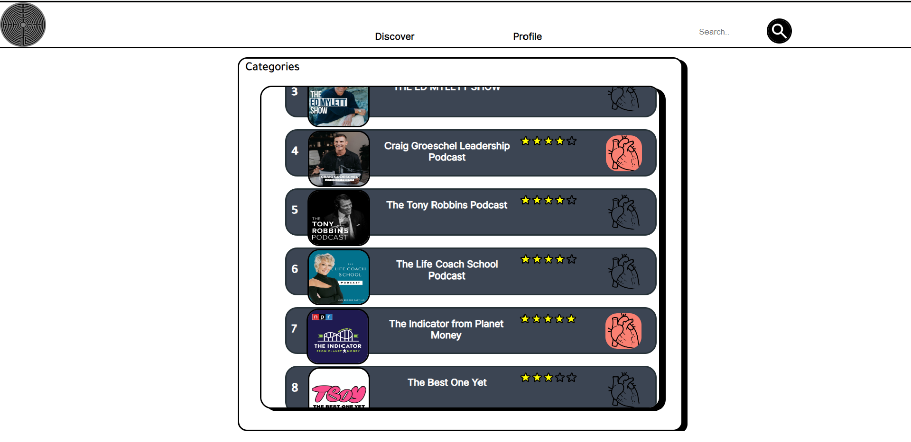
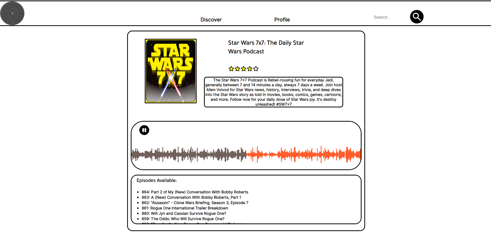

# AudioMaze

AudioMaze is a web app (mobile version coming soon) aimed at those who like to dive deep into the world of audio education! The app is a tool to find, listen and follow your favorite podcast. Uses impressive API library helpful to discover new shows. This brings two main benefits:

1. It documents your listening history, and gives you flexible access to your saved podcast.
2. Helps you to find similar episodes or track currently popular shows.

## Getting Started

1. Clone this repo and enter! 
  - git clone https://github.com/Rob4ert/AudioMaze

2. In the project client folder, you can run:
  - npm i (to install all the required dependencies)
  - npm start (Node needed)
 In the project server directory, you can run:
  -npm i (same as the above)
  -node index.js
  

### TechStack
  
  Frontend:
    - React,
    - Waveform,
    - Firebase
   
  Backend: 
    - MongoDB,
    - Mongoose,
    - Express,
      

### Screenshots

### Developers

  Robert Rybczynski
